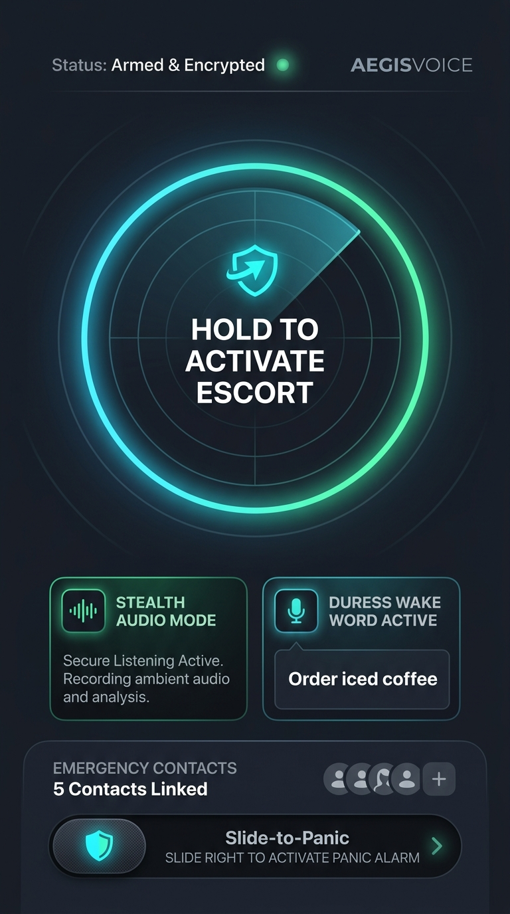
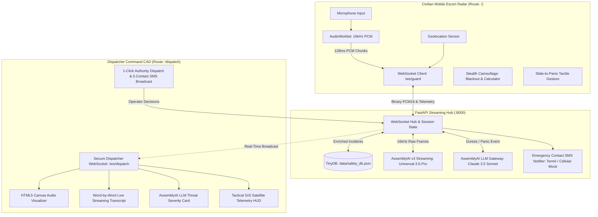

# AegisVoice — Real-Time Autonomous Emergency Voice Intelligence & CAD Triage Dispatcher

<div align="center">



[](https://lablab.ai/event/assemblyai-voice-agent-hackathon)
[](https://www.assemblyai.com/docs/speech-to-text/streaming)
[](https://www.assemblyai.com/docs/llm-gateway)
[](https://nextjs.org/)
[](https://fastapi.tiangolo.com/)
[](LICENSE)

**Quiet courage. Invisible protection. Instant rescue.**

[Live Civilian Escort (/)](https://web-xi-weld-22.vercel.app/) • [CAD Operator Command Center (/dispatch)](https://web-xi-weld-22.vercel.app/dispatch) • [System Architecture](#system-architecture) • [Quickstart Guide](#quickstart--developer-setup)

</div>

---

## 1. The Crisis We Face (Problem Statement)

> *"Every time my sister leaves the house, my heart skips. I have no idea what she will encounter on the road, what anyone might try to do to her, or whether she will make it back home safely. The later it gets, the less likely you are to return. That is not just fear — that is the daily reality of walking our streets."*

In Nigeria and developing urban centers worldwide, violent street crime has normalized into an everyday curfew of fear:
* **Unexplained Disappearances:** People leave home for school, work, or errands across Lagos, Abuja, and Port Harcourt and vanish without a trace.
* **The Impunity of Street Predators:** Kidnappings, armed ambushes, and "one-chance" commercial bus robberies operate with near-zero prosecution rates.
* **Overwhelmed Emergency Desks:** Law enforcement and emergency response hotlines (112 / 767) are under-resourced, receiving reports hours or days after victims go missing.
* **Bystander Apathy:** In crowded bus stops and markets, onlookers frequently hesitate or tune out screams for help out of fear for their own lives.

### Why Traditional Emergency Apps Fail in Real Confrontations
Traditional safety apps rely on **loud sirens** or **manual panic buttons** requiring users to pull out their phone, unlock the screen, and dial numbers. 
1. **Touching a Phone Provokes Immediate Lethal Violence:** When an attacker approaches with a knife or firearm, reaching for a phone invites an immediate physical strike.
2. **The Forced Compliance Trap for Women:** When cornered by aggressive men, women often have to pretend to laugh, smile, or play along to de-escalate tension and buy time. Any overt gesture of resistance triggers assault.
3. **OS Hardware Sandboxing:** Mobile operating systems (iOS and Android) sandbox web apps and reserve native hardware buttons (power/volume) for system tasks.

**When your hands are restricted and shouting gets you killed, the only weapon you have left is your voice.**

AegisVoice solves this crisis through **hands-free, covert speech intelligence** powered by **AssemblyAI Universal-3.5-Pro** streaming STT and **AssemblyAI LLM Gateway** real-time crisis triage.

---

## 2. The AegisVoice Solution

AegisVoice bridges civilian distress and law enforcement dispatch across two tightly integrated, responsive surfaces hosted in a single unified web platform (`apps/web`):

| The Street Reality | How AegisVoice Responds |
| :--- | :--- |
| **You cannot touch your phone:** | **Armed Escort Mode:** The user arms the app once before walking (1.2s press-and-hold). The screen stays awake via `navigator.wakeLock`, streaming background audio continuously off-thread through a dedicated `AudioWorklet`. |
| **You must pretend to be calm:** | **Covert Duress Wake-Phrase:** The user casually says: *"Hey, no problem, just let me order iced coffee"* or *"Call my auntie in Lekki"*. To the attacker, they are complying. To AssemblyAI, the secret phrase trips an instantaneous silent distress beacon. |
| **An attacker looks at your screen:** | **Stealth Decoy Camouflage:** One tap switches the screen to **Pitch Black** (0% perceived brightness with covert double-tap restore) or a **Functional Working Calculator** disguise while the microphone continues streaming silently off-thread. |
| **You are choked, attacked, or scream:** | **Acoustic Decibel Threshold:** High-energy decibel spikes (>88dB) automatically trip the emergency protocol even if no coherent words can be formed. |
| **Police and family need instant context:** | **Autonomous LLM Crisis Triage:** AssemblyAI's LLM Gateway (`claude-sonnet-4-6`) analyzes ambient speech in real time, detecting weapons, scoring distress (9.8/10), and transmitting live GPS coordinates to 5 family contacts and CAD operators in under 3 seconds. |

---

## 3. System Architecture



---

## 4. Key Technical Innovations

### 🎙️ AssemblyAI Universal-3.5-Pro Real-Time Speech Streaming
- **Connection Endpoint:** `wss://streaming.assemblyai.com/v3/ws?sample_rate=16000&speech_model=universal-3-5-pro&mode=balanced&voice_focus=near-field`
- **Near-Field Voice Focus:** Filters out generator noise, traffic roar, and ambient street commotion while isolating the civilian's near-field speech.
- **Sub-Second Latency:** Delivers partial and finalized word-by-word turns with crisis keyword highlights (`gun`, `knife`, `weapon`, `help`, duress phrases).
- **Explicit Session Termination:** Sends `{"type": "Terminate"}` upon escort completion to prevent the 3-hour streaming billing cap.

### 🧠 AssemblyAI LLM Gateway Crisis Triage Engine
- **Endpoint:** `POST https://llm-gateway.assemblyai.com/v1/chat/completions`
- **Model:** `claude-sonnet-4-6` (with `gemini-2.5-pro` and local heuristic fallback).
- **Structured JSON Schema:**
  ```json
  {
    "threat_level": "CRITICAL",
    "emergency_type": "Armed Violent Confrontation",
    "caller_distress_score": 9.8,
    "weapons_detected": "deadly_weapon_indicated",
    "suspect_count": "1 or more aggressors",
    "recommended_action": "IMMEDIATE_POLICE_DISPATCH",
    "tactical_summary": "Victim cornered by armed aggressor; immediate tactical intervention required."
  }
  ```

### 📡 Off-Thread AudioWorklet 16kHz PCM Downsampler
- Runs entirely off the browser's main thread in `apps/web/public/audio-processor.js`.
- Intercepts native 44.1kHz / 48kHz Float32 microphone input and downsamples linearly to strict **16,000 Hz, 16-bit Mono Linear PCM (`Int16Array`)**.
- Emits raw binary buffers every ~128ms over WebSocket with zero main-thread UI jank.

### 🛰️ Tactical GIS Satellite Telemetry HUD
- Zero-crash, high-density telemetry component replacing brittle client-side map wrappers.
- Displays formatted Latitude, Longitude, GNSS satellite fix status, and precision radius (`±4.5m Precision Radius`).
- Includes a 1-click **"Open in Google Maps"** launcher opening satellite coordinates in a new tab.

### 🗄️ Embedded Local Document Persistence (`TinyDB`)
- Self-contained, zero-configuration Python document database stored in `backend/data/safety_db.json`.
- Maintains pre-seeded and dynamically registered user profiles (Sarah Jenkins, Amina Bello, Akinsanmi Success), emergency contact circles, medical records (blood type, allergies), and audited CAD incidents.

---

## 5. Dual Architectural Strategy

AegisVoice is architected with dual deployment profiles:

1. **The Unified Hackathon Champion (`PRD_MERGED.md` — Active in `apps/web`):**
   - Packaged into a single Next.js 14 multi-route platform.
   - Route `/` serves the Civilian Escort; route `/dispatch` serves the CAD Command Center.
   - Single Vercel deployment URL, zero CORS configuration, instant 1-click judge navigation via `DemoNavbar.tsx`, and an ultra-low RAM footprint (~160MB RAM).
2. **The Commercial Enterprise Air-Gapped Blueprint (`PRD.md`):**
   - Independent dual-application architecture (`apps/guard-pwa` and `apps/dispatch-portal`).
   - Ensures zero operator/dispatch code or keys leak into civilian mobile packages for post-hackathon enterprise rollouts with private security estates and municipal emergency agencies.

---

## 6. Quickstart & Developer Setup

### Prerequisites
- **Node.js:** 18.0+
- **Python:** 3.10+
- **AssemblyAI API Key:** Free key from [AssemblyAI Console](https://www.assemblyai.com/)

### 1-Command Ultra-Low-RAM Runner (Recommended)
Our production orchestrator runs both the FastAPI backend and Next.js frontend within a strict memory budget (**~160 MB RAM**, 10x lighter than unconstrained dev servers):

```powershell
# In root directory:
.\run_unified.ps1
```

Once running, access:
* **Civilian Mobile Escort Radar:** [http://localhost:3000/](http://localhost:3000/)
* **CAD Dispatch Command Center:** [http://localhost:3000/dispatch](http://localhost:3000/dispatch)
* **FastAPI Backend Health:** [http://localhost:8000/api/health](http://localhost:8000/api/health)

To stop all servers cleanly and release 100% of memory:
```powershell
.\stop_servers.ps1
```

---

### Manual Step-by-Step Setup

#### Step 1: Backend Setup
```bash
cd backend
python -m venv venv
venv\Scripts\activate            # Windows PowerShell
pip install -r requirements.txt

# Configure your AssemblyAI API Key in backend/.env:
# ASSEMBLYAI_API_KEY=your_actual_key_here

uvicorn main:app --host 0.0.0.0 --port 8000 --reload
```

#### Step 2: Frontend Setup
```bash
cd apps/web
npm install
npm run build                    # Build production bundle
npm run start                    # Starts on http://localhost:3000
```

---

## 7. Hackathon Judge Evaluation Walkthrough

Follow this 4-step script during evaluation:

1. **Step 1: Open Civilian Escort (`http://localhost:3000/`)**
   - Click **"Load Sarah Jenkins (Instant Demo)"** in the top vault banner or register a new profile with custom duress phrase.
   - Observe the tactical dark theme, screen wake lock active indicator, and duress phrase pill (*"Order iced coffee"*).
2. **Step 2: Arm Escort Mode**
   - Press and hold **"HOLD TO ACTIVATE ESCORT"** for 1.2 seconds.
   - The concentric radar sweep activates, the emerald LED pulses, and 16kHz PCM audio begins streaming.
   - Test the stealth camouflage: click the **Eye Icon** (Pitch-Black blackout with double-tap wake) or **Calculator Icon** (working calculator disguise).
3. **Step 3: Trigger Covert Distress**
   - Speak your configured duress phrase (*"Order iced coffee"*) or drag the **Slide-to-Panic** thumb to the right.
   - Phone vibrates quietly with haptic alert without ringing or alerting aggressors.
4. **Step 4: Switch to CAD Command Center (`http://localhost:3000/dispatch`)**
   - Use the top navigation bar to click **[Dispatcher CAD (/dispatch)]**.
   - Observe the critical crimson banner flashing at the top.
   - Review the **Tactical GIS HUD** showing coordinates and precision lock.
   - Watch the **Canvas Waveform** bounce in real time.
   - Read the **Word-by-Word Live Transcript** highlighting keywords (*"iced coffee"*, *"help"*) in red.
   - Inspect the **AssemblyAI LeMUR Threat Card** displaying structured crisis classification, 9.8/10 distress score, and recommended police action.
   - Click **[1-CLICK DISPATCH AUTHORITIES]** to generate CAD ticket `CAD-2026-XXXX`.
   - Click **[BROADCAST SMS (5)]** to dispatch emergency coordinates to the victim's 5 emergency contacts.

---

## 8. Directory Structure

```text
AegisVoice/
├── README.md                        # Master documentation & pitch (You are here)
├── package.json                     # Root monorepo scripts
├── aegis_user_main_screen.jpg       # Reference UI design & tactical HUD mockup
├── run_unified.ps1                  # Single unified low-RAM runner (~160MB RAM)
├── stop_servers.ps1                 # Immediate memory & port reclamation script
│
├── apps/
│   └── web/                         # Unified Next.js 14 Application (Civilian & CAD)
│       ├── .env.example             # Frontend environment template
│       ├── public/
│       │   ├── audio-processor.js   # Off-thread 16kHz PCM AudioWorklet downsampler
│       │   └── manifest.json        # PWA mobile configuration
│       └── src/
│           ├── app/
│           │   ├── layout.tsx       # Root layout with Demo Switcher Navigation
│           │   ├── page.tsx         # Route /: Civilian Mobile Escort Radar
│           │   ├── dispatch/
│           │   │   └── page.tsx     # Route /dispatch: CAD Command Center
│           │   └── globals.css      # Dark tactical styling
│           ├── components/
│           │   ├── DemoNavbar.tsx   # Top demo switcher for judges
│           │   ├── guard/           # TacticalRadar, SlideToPanic, DecoyMode, RegistrationWizard
│           │   └── dispatch/        # TacticalGISHUD, AudioWaveform, LiveTranscript, ThreatCard, Actions
│           └── hooks/               # useAudioStream, useWakeLock, useDispatchSocket
│
└── backend/                         # FastAPI Real-Time Streaming Hub (Port 8000)
    ├── main.py                      # Dual WebSocket endpoints (/ws/guard, /ws/dispatch) + REST
    ├── db.py                        # TinyDB persistence wrapper with dynamic victim auto-join
    ├── requirements.txt             # Python dependencies
    ├── .env.example                 # Backend environment template
    ├── data/
    │   └── safety_db.json           # Embedded document database
    └── services/
        ├── assemblyai_stt.py        # AssemblyAI v3 Real-Time STT (Universal-3.5-Pro)
        ├── llm_triage.py            # AssemblyAI LLM Gateway (Claude 3.5 Sonnet)
        └── notifier.py              # Emergency SMS relay (Termii / Cellular Simulation)
```

---

## 9. Hackathon Team & Acknowledgments

* **Hackathon:** AssemblyAI Voice Agent Hackathon (hosted by [lablab.ai](https://lablab.ai))
* **Core Technology:** [AssemblyAI](https://www.assemblyai.com/) (Streaming STT v3 Universal-3.5-Pro & LLM Gateway)
* **Built with Heart in Nigeria:** For our sisters, our mothers, and every civilian walking home in the dark.

---

## 10. License

This project is licensed under the MIT License — see the [LICENSE](LICENSE) file for details.
